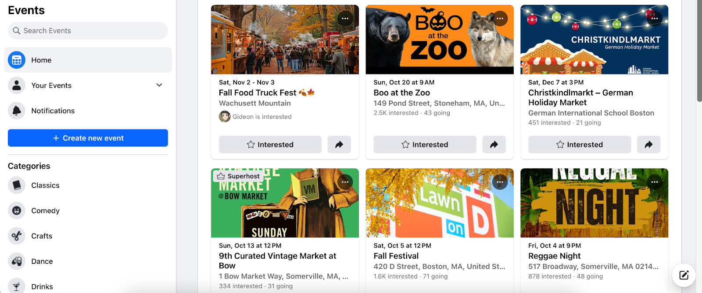

# Assignment 2: Divergent Design

Audience and Value:

The app that I am choosing to create is an app called 2ToTango, which will allow dancers to know about upcoming dance events and other dancers who are attending. The intended audience of this app is dancers in Cambridge and Boston. This app will bring value to users beyond existing apps by not only consolidating events in one space so that users can browse through all of them at once, but also by showing who else has accepted invites so that they can go with friends or familiarize themselves with strangers also attending the class by looking at their profiles.

—--

Comparables:
- Google Maps

    - This screenshot comes from Google Maps, and it shows all the CVS’s in my area. I could use an interface like this to show all the dance events in an area.

- Facebook’s events page

    - This screenshot comes from Facebook’s events page, which shows upcoming events, their locations, and who else is attending. It also shows the profile pictures of your friends who are interested or attending. This type of interface would be useful for users to browse through dance workshops and classes.

- Instagram posts

    - This screenshot comes from Instagram, and shows how you can post videos and pin certain ones to your profile. This would be useful for users to pin the videos of themselves dancing that they like the most so that other users can get an idea of what style of dance they specialize in.

- Facebook’s groups page

    - This is a screenshot of Facebook’s groups page, which shows different groups that you can join. This would be useful for different dance studios or dance crews to create a space centering their members and events.

- Doordash filters

    - This screenshot from Doordash shows how users can filter their searches for specific types of food and groceries. This design would be useful for users to filter by dance genre - Tap, Hip Hop, Contemporary, etc. - and the icons would make for a brighter and more visually appealing interface.

---

Feature Brainstorming:
1. Genre Filter: Dance events are required to select a dance genre that the event centers around: Tap, Ballet, Hip Hop, Jazz, Contemporary, etc. If it doesn’t focus on any specific style of dance, there is also an “All” option.
2. Location Filter: Users can select a certain radius, such as 20 miles, such that they only find events within that radius.
3. Time Filter: Users can select events within a certain time frame, such as the upcoming 3 days. Alternatively, they can fill out a weekly conflicts calendar, much like When2Meet, which allows them to find recurring events such as weekly dance classes that fit into their schedule.
4. Highlights: Users can upload short videos of their dancing on their profile. These videos are limited to 1 minute in length and can be pinned to the top of their profile about their other videos.
5. Organizations: Users can join dance groups, such as dance crews and dance studios. After joining an organization, users will have the name of the organization on their profile, as part of their bios.
6. Invites: Users can invite other users to dance events and users can respond by rejecting, selecting that they are interested, or accepting.
7. Required Information: In order to create an event, users must input certain required information. For example, genre, time, and location are required, as mentioned above. If the event is not free, the price is required to be shown. In addition, the choreographer/teacher is also required information, and users can click on the choreographer’s profile to read their bio.
8. Hyperlinks: Props are also required information. For example, tap dance requires/strongly recommends tap shoes, fan dance requires fans, etc. The description of the event will have to state whether or not these props are provided. If not, choreographers can add hyperlinks to cheap props that they recommend users to buy. Hyperlinks will also be available to buy tickets for events that require tickets.
9. Private Events: Certain events that are only open to certain groups - for example, a workshop from MIT Mocha Moves would only be open to MIT students - will only be shown to users that have joined the MIT Dance organization.
10. Experience-Based Biographies: Rather than allowing biographies to be completely personalized, like Instagram, people can list dance experience as part of certain organizations, somewhat similar to LinkedIn. However, it will not be as formal as LinkedIn, in order to cultivate a more relaxed and fun experience.
11. Open Studio Spaces: The map feature will also have an option to find good spaces to practice dance, such as community centers or gyms that have large mirrors. This is useful for users who have graduated college and now no longer have access to the same dance studios that they used to use.
12. Recommendations: Events that many friends are attending or interested in will be highlighted with a different color so that they will catch the attention of users.
13. Friend Suggestions: The profiles of dancers with mutual friends will be suggested to users.
14. Maps: Aside from being able to filter out events based on distance, users can also swipe through a map that has pins dropped on the locations of certain events.
15. Portfolio: Users who wish to create a dance portfolio can create one on the app. It will be located under a separate heading on their profiles, much like Instagram has different sections on user profiles for posts, reels, and tagged photos.

—--

VSD Analysis:
    - Stakeholders #2, Variation in Human Ability: Most dancers that we see on social media are able-bodied. However, it is very achievable for a person with limb amputations to be a dancer. For example, waacking and tutting predominantly focus on arms, while tap dancing predominantly focuses on legs. In order to increase visibility of dancers with amputations, I could add an algorithm that boosts events hosted by disabled dancers.
    - Stakeholders #7, Consider Children: Although dance is meant to uplift and empower, it can oftentimes lead to comparing oneself to others and losing confidence. A child might see the videos posted by users on this app and compare themself to people with much more experience, thus leading to feelings of inadequacy. A possible solution is implementing age restrictions such that children cannot use the app.
    - Time #7, Long-Term Health and Well-Being: Generally speaking, engaging in dance events should lead to a healthier body due to increased exercise. However, dancers frequently get injured when they don’t properly take care of their bodies. Interacting with this app could cause dancers to get injured more frequently, and being more aware of the events going on around them while they are resting could lead to feelings of missing out.
    - Pervasiveness #3, Crossing National Boundaries: Dance is often used to promote sexuality and body positivity, but this might conflict with certain cultural standards in other countries. For example, dance styles such as pole dance may be regarded as offensive by societies that value modesty. One possible solution is to detect the amount of skin in each video, and ban it in certain countries if it’s deemed to be too much.
    - Values #3, User Experience of Values: Many dancers feel that the dance community should support and encourage all dancers, regardless of skill level. However, by using this app more frequently, users may find themselves looking down upon beginner dancers and only respecting experienced dancers. One way to lessen this is to have events provide a difficulty level (beginner, intermediate, or advanced) and use an algorithm to promote beginner-friendly events.

—--

Storyboard Sketches:

Flow 1:

Flow 2:
