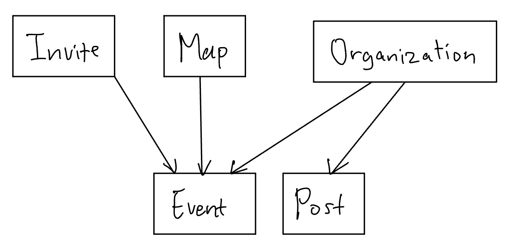
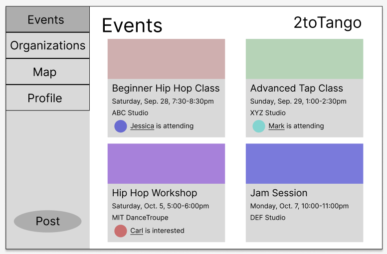
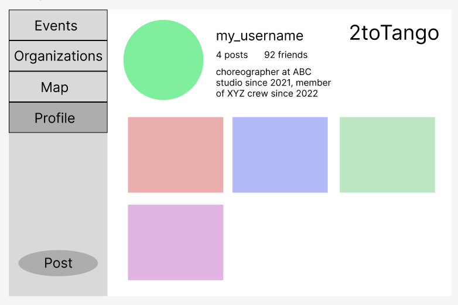
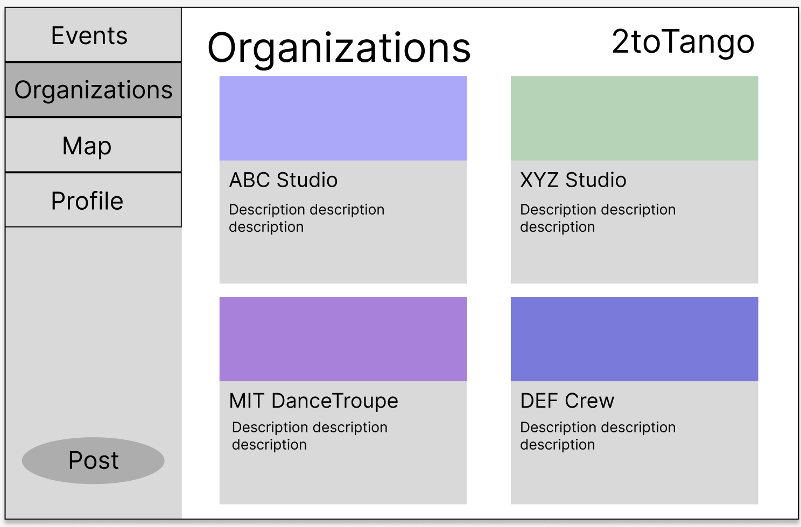
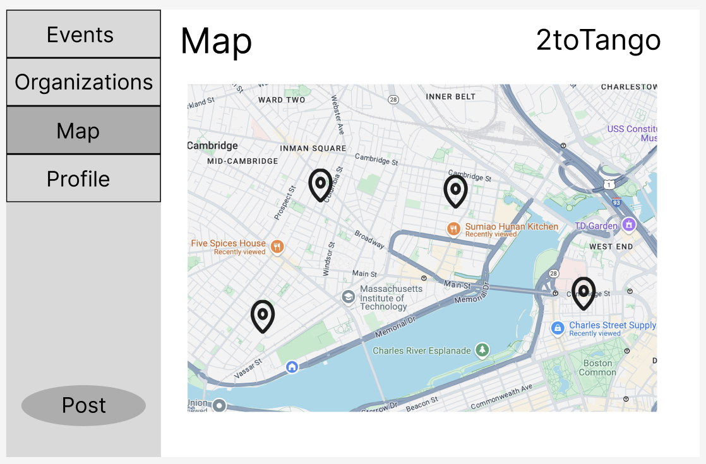
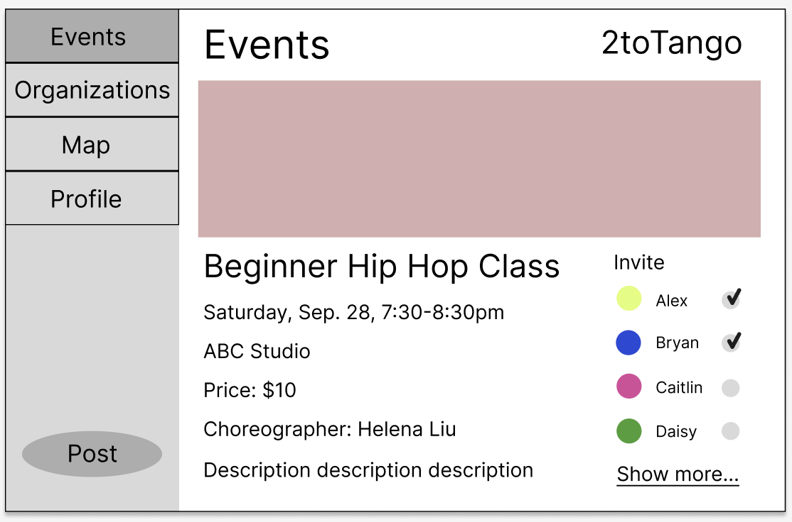

# Assignment 3: Convergent Design

---

Pitch:

The app that I am creating is a dance-based social media network called 2toTango. This app will inform dancers about upcoming dance events and other dancers that are attending. The intended audience of this app is dancers in the Cambridge and Boston area. This app brings value to users by consolidating events in one page so that users can browse through them all at once. It also shows who else is interested or going to each event so that users can attend with friends or recognize familiar faces that they’ve seen at other events. The goal of this app is to bring the dance community closer together and help dancers feel more comfortable attending classes and workshops.

—--

Concepts:
1. Concept Name: Events
    - Purpose: Users can create an event to inform others about upcoming classes, workshops, etc.
    Operational Principle: Users input certain required information about their event (name, time, location, etc.) and the event is created on the events page for other users to see until the event has passed
    - State: 
        - name: one String
        - time: one Date
        - location: one String
        - choreographers: set String
        - genres: set String
        - props: set String
        - price: one Float
        - description: one String
        - attendees: set User
    - Actions:
        - createEvent (name: String, time: Date, location: String, choreographers: set String, genres: set String, props: set String, price: Float, description: String)
        - deleteEvent (event: Event)
        - updateName (event: Event, name: String)
        - updateTime (event: Event, time: Date)
        - updateLocation (event: Event, location: String)
        - addChoreog (event: Event, choreographer: String)
        - deleteChoreog (event: Event, choreographer: String)
        - addGenre (event: Event, genre: String)
        - deleteGenre (event: Event, genre: String)
        - addProp (event: Event, prop: String)
        - deleteProp (event: Event, prop: String)
        - updatePrice (event: Event, price: Float)
        - updateDescription (event: Event, description: String)
        - invite (event: Event, user: User)

2. Concept Name: Posts
    - Purpose: Users can upload videos showcasing their dance ability
    - Operational Principle: Users upload a video (maximum 1 minute) that displays their dancing, and the video is posted onto their profile. This post appears in a grid of posts on the profile and can be tapped on to be watched
    - State:
        - const video: one Video //no photos
        - const description: one String
    - Actions:
        - createPost (video: Video, description: String)
        - watchPost (post: Post)
        - deletePost (post: Post)

3. Concept Name: Organizations
    - Purpose: Users can join organizations to find other people that attend the same dance studio or are part of the same dance team
    - Operational Principle: Users create an organization and other users can join. Public organizations allow all users to join, while private organizations have someone currently a part of the organization approve new members. Organizations can be searched for on the organizations page
    - State: 
        - name: one String
        - description: one String
        - members: set User
        - posts: set Post
        - events: set Event
        - private: one Boolean //false is public, true is private
    - Actions:
        - createOrg (name: String, description: String, creator: User, private: Boolean) //creator gets added to set of members
        - deleteOrg (org: Organization)
        - updateName (org: Organization, name: String)
        - updateDescription (org: Organization, description: String)
        - addMember (org: Organization, member: User)
        - deleteMember (org: Organization, member: User)
        - addPost (org: Organization, post: Post)
        - deletePost (org: Organization, post: Post)
        - addEvent (org: Organization, event: Event)
        - deleteEvent (org: Organization, event: Event)
        - makePublic(org: Organization) 
        - makePrivate(org: Organization)  

4. Concept Name: Map
    - Purpose: Users can scroll through a map to find locations of events relative to their current location
    - Operational Principle: Users open the map page and are prompted to input some values into filters (date, location, and genre), none of which they are required to fill out. Then, based on these filters, pins are dropped on the map showing events that satisfy the constraints described by the filters, as well as a differently colored pin indicating current location. These pins can be tapped on to bring up a small window showing what event they correspond to, and tapping away from these pins makes the window disappear.
    - State:
        - events: set Event
        - dateFilter: set Date
        - currentCoord: Coord //gps coordinates, not address
        - locationRadius: Int
        - genreFilter: set String
    - Actions:
        - scroll (map: Map)
        - dropPins (map: Map, dateFilter: set Date, currentCoord: Coord, locationRadius: Int, genreFilter: set String)
        - tapPin (map: Map, event: Event)
        - untapPin (map: Map, event: Event)

5. Concept Name: Invites
    - Purpose: Users can invite other users to events to spread the word.
    - Operational Principle: If a user wants to send an invite to another user, they tap on the invite button and search for the user that they want to send the invite to. When a user receives an invite, they can choose to respond “yes” or “no”, or leave it unanswered.
    - State: 
        - event: one Event
        - inviter: one User
        - invitee: one User
        - status: one String //can be “no”, “yes”, or “unanswered”
    - Actions:
        - createInvite (event: Event, inviter: User, invitee: User) //default status is unanswered
        - acceptInvite (invite: Invite)
        - declineInvite (invite: Invite)

Dependency Diagram: 

—--

Wireframes:

Events Page:

User Profile:

Organization Page:

Map Page:

Invite Function:

—--

Design Tradeoffs:

1. Invite Location
    - The first option I considered for implementing the invite feature is to have a separate invite page after clicking on an invite button where you can search for users. The second option I considered was an invite sidebar, and if the user you want isn’t there, you can click “show more” to expand the list.
    - I chose the second option because I felt the invite feature wasn’t expansive enough to warrant an entire page. The invite sidebar also allows users to invite people while reading the event details, instead of needing to backtrack to read them after inviting.
2. Event Layout
    - The first option I considered for implementing how events would appear is a grid of events. The second option I considered was similar to a “For You” page, where a single event would take up the entire screen and users would scroll through these.
    - I chose the first option because I felt that users would not want to scroll back to the top to find events that they’re interested in. The grid seemed to be more convenient and intuitive.
3. Event Information Display
    - I wasn’t sure how much of the required event information I should display on the event grid. For example, should I only show name, time, and location, and have more information available by clicking on the event, or should I include more details like choreographer and price?
    - I chose to only display name, time, and location because I felt that most users would be able to rule out events based on this information alone, and additional information would make the screen too cluttered.
