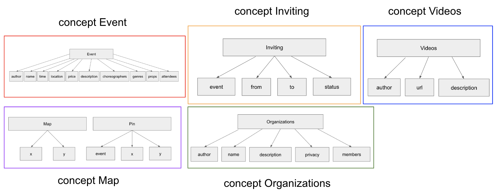

# Assignment 4: Backend Design & Implementation (Beta)

---

Abstract Data Models:
1. Concept Name: Events
    - Purpose: Users can create an event to inform others about upcoming classes, workshops, etc.
    - Operational Principle: Users input certain required information about their event (name, time, location, etc.) and the event is created on the events page for other users to see until the event has passed
    - State: 
        - author: one User
        - name: one String
        - time: one String
        - location: one String
        - price: one Number
        - description: one String
        - choreographers: array String
        - genres: array String
        - props: array String
        - attendees: array String
        - events: set Event
    - Actions:
        - createEvent (author: User, name: String, time: String, location: String, price: Number, description: String). This creates an event with the given parameters, and an empty array for choreographers, genres, props, and attendees. This event is added to the events set.
        - deleteEvent (event: Event). This removes the given event from the events set.
        - getEvent (event: Event). This returns the given event from the events set.
        - getAllEvents (). This returns all events in the events set.
        - updateEvent (event: Event, name?: String, time?: String, location?: String, price?: Number, description?: String). This updates an event with the given parameters, which are all optional.
        - addChoreog (event: Event, choreographer: String). This adds a choreographer to the choreographers array of the given event.
        - deleteChoreog (event: Event, choreographer: String). This deletes a choreographer from the choreographers array of the given event.
        - addGenre (event: Event, genre: String). This adds a genre to the genres array of the given event.
        - deleteGenre (event: Event, genre: String). This deletes a genre from the genres array of the given event.
        - addProp (event: Event, prop: String). This adds a prop to the props array of the given event.
        - deleteProp (event: Event, prop: String) This deletes a prop from the props array of the given event.
        - addAttendee (event: Event, attendee: String). This adds an attendee to the attendee array of the given event.
        - deleteAttendee (event: Event, attendee: String). This deletes an attendee from the attendee array of the given event.
        - assertUserNotAttendee (event: Event, user: User). This asserts that the user is not an attendee of the event.
        - assertAuthorIsUser (event: Event, user: User). This asserts that the user is the author of the event.
2. Concept Name: Video
    - Purpose: Users can upload videos showcasing their dance ability
    - Operational Principle: Users upload a video (maximum 1 minute) that displays their dancing, and the video is displayed on their profile. This video appears in a grid of videos on the profile and can be tapped on to be watched.
    - State:
        - author: one User
        - const url: one String
        - const description: one String
        - videos: set Video
    - Actions:
        - createVideo (author: User, url: String, description: String). This creates a video with the given parameters and adds it to the videos set.
        - deleteVideo (video: Video). This deletes the given video from the videos set.
        - getVideo (video: Video). This returns the given video from the videos set.
        - getAllVideos (). This returns all videos in the videos set.
        - assertAuthorIsUser (video: Video, user: User). This asserts that the user is the author of the video.
3. Concept Name: Organizations
    - Purpose: Users can join organizations to find other people that attend the same dance studio or are part of the same dance team
    - Operational Principle: Users create an organization and other users can join. Public organizations allow all users to join, while private organizations have someone currently a part of the organization approve new members. Organizations can be searched for on the organizations page
    - State: 
        - author: one User
        - name: one String
        - description: one String
        - privacy: one Boolean //false is public, true is private
        - members: array String
        - organizations: set Organization
    - Actions:
        - createOrg (author: User, name: String, description: String, privacy: Boolean). This creates an organization with the given parameters. The author is added to the array of members. This organization is added to the organizations set.
        - deleteOrg (org: Organization). This deletes the given organization from the organizations set.
        - getOrg (org: Organization). This returns the given organization from the organizations set.
        - getAllOrgs (). This returns all organizations from the organizations set.
        - updateOrg (org: Organization, name?: String, description?: String). This updates the given organization with the given parameters, which are all optional.
        - addMember (org: Organization, member: User). This adds a member to the members array of the given organization.
        - deleteMember (org: Organization, member: User). This deletes a member from the members array of the given organization.
        - makePublic (org: Organization). This sets the privacy of the given organization to false.
        - makePrivate (org: Organization). This sets the privacy of the given organization to true.
        - assertAuthorIsUser (org: Organization, user: User). This asserts that the user is the author of the organization.
4. Concept Name: Map
    - Purpose: Users can scroll through a map to find locations of events
    - Operational Principle: Users open the map page. Pins are dropped on the map showing dance events. These pins can be tapped on to bring up a small window showing what event they correspond to, and tapping away from these pins makes the window disappear.
    - State:
        - Map:
            - x: Number; //x coordinate of center of map
            - y: Number; //y coordinate of center of map
            - maps: set Map //will only contain one map
        - Pin:
            - event: Event
            - x: Number //x coordinate of event
            - y: Number //y coordinate of event
            - pins: set Pin
    - Actions:
        - createMap (). This creates a map, with x and y both set to 0, and adds it to the map set.
        - getMap (map: Map). This returns the given map from the map set.
        - scroll (map: Map, x_scroll: Number, y_scroll: Number). This adds the value of x_scroll and y_scroll to the x and y values of the given map.
        - makePin (event: Event, x: Number, y: Number). This creates a pin with the given event, x coordinate, and y coordinate, and adds it to the pins set.
        - getPinEventId (pin: Pin). This returns the event ID of the given pin.
5. Concept Name: Invites
    - Purpose: Users can invite other users to events to spread the word.
    - Operational Principle: If a user wants to send an invite to another user, they tap on the invite button and search for the user that they want to send the invite to. When a user receives an invite, they can choose to respond “yes”, “no”, or “maybe”, or leave it unanswered.
    - State: 
        - event: one Event
        - from: one User
        - to: one User
        - status: one String //can be “rejected”, “accepted”, or “pending”
        - invites: set Invite
    - Actions:
        - sendInvite (event: Event, from: User, to: User). This creates an invite with the given parameters. The default status is pending. This invite is added to the invites set.
        - acceptInvite (event: Event, from: User, to: User). This removes the pending invite from the "from" user to the "to" user and creates another invite with the same values, except the status is "accepted". This invite is added to the invites set.
        - rejectInvite (event: Event, from: User, to: User). This removes the pending invite from the "form" user to the "to" user and creates another invite with the same values, except the status is "rejected". This invite is added to the invites set.
        - removeInvite (event: Event, from: User, to: User). This removes a pending invite with the corresponding event, from, and to values from the invites set.
        - getInvites (user: User). This returns all invites from and to the given user.

---

App Concepts:
  1. Sessioning
  2. Authing
  3. Posting
  4. Friending
  5. Inviting
  6. Events
  7. Organizations
  8. Videos
  9. Map

---

App-level Actions:
  1. createEvent synchronizes Sessioning's getUser and Events's createEvent
  2. deleteEvent synchronizes Sessioning's getUser and Events's deleteEvent
  3. getEvent calls Event's getEvent
  4. getAllEvents calls Event's getAllEvents
  5. updateEvent synchronizes Sessioning's getUser and Events's updateEvent
  6. addChoreog synchronizes Sessioning's getUser and Events's addChoreog
  7. deleteChoreog synchronizes Sessioning's getUser and Events's deleteChoreog
  8. addGenre synchronizes Sessioning's getUser and Events's addGenre
  9. deleteGenre synchronizes Sessioning's getUser and Events's deleteGenre
  10. addProp synchronizes Sessioning's getUser and Events's addProp
  11. deleteProp synchronizes Sessioning's getUser and Events's deleteProp
  12. addAttendee synchronizes Sessioning's getUser and Events's addAttendee
  13. deleteAttendee synchronizes Sessioning's getUser and Events's deleteAttendee
  14. sendInvite synchronizes Sessioning's getUser, Authing's getUserByUsername, Events's assertUserNotAttendee, and Inviting's sendInvite.
  15. removeInvite synchronizes Sessioning's getUser, Authing's getUserByUsername, and Inviting's removeInvite
  16. acceptInvite synchronizes Sessioning's getUser, Authing's getUserByUsername, Inviting's acceptInvite, and Events's addAttendee
  17. rejectInvite synchronizes Sessioning's getUser, Authing's getUserByUsername, and Inviting's rejectInvite
  18. getInvites synchronizes Sessioning's getUser and Inviting's getInvites
  19. createOrg synchronizes Sessioning's getUser and Organization's createOrg
  20. deleteOrg synchronizes Sessioning's getUser and Organization's deleteOrg
  21. updateOrg synchronizes Sessioning's getUser, Organization's assertAuthorIsUser, and Organization's updateOrg
  22. getOrg calls Organization's getOrg
  23. getAllOrgs calls Organization's getAllOrgs
  24. addMember synchronizes Sessioning's getUser, Organization's assertAuthorIsUser, and Organization's addMember
  25. deleteMember synchronizes Sessioning's getUser, Organization's assertAuthorIsUser, and Organization's deleteMember
  26. makePublic synchronizes Sessioning's getUser, Organization's assertAuthorIsUser, and Organization's makePublic
  27. makePrivate synchronizes Sessioning's getUser, Organization's assertAuthorIsUser, and Organization's makePrivate
  28. createMap calls Map's createMap
  29. getMap calls Map's getMap
  30. scrollMap calls Map's scroll
  31. makePin calls Map's makePin
  32. getPinEventId calls Map's getPinEventId
  33. createVideo synchronizes Sessioning's getUser and Video's createVideo
  34. getVideo calls Video's getVideo
  35. getAllVideos calls Video's getAllVideos
  36. deleteVideo synchronizes Sessioning's getUser, Video's assertAuthorIsUser, and Video's deleteVideo

---

Diagram:

---

Design Reflection:

While implementing the backend, I made changes to the designs of all my concepts. For some concepts, these changes were minor, such as changing the data type of state variables. For example, I changed the “time” state variable to be a string rather than a Date object, as I felt that entering a range of time such as “7 - 9pm” is easier to manage as a string, rather than having two Date objects. 

For other concepts, I completely changed the state variables and actions. One example of this was the Map concept. Prior to implementing the backend, the inner workings of the Map concept were not very fleshed out in my mind. As I worked on it, I realized that filtering by distance did not need to be part of the Map concept. Instead, the Events concept would return all events, and while implementing the frontend, I would use some API to find the latitude and longitude of the events. This coordinate information would then be passed to the makePin function in the map’s concept, and pins would only be displayed on the frontend if the map were displaying an area that contained the pin. Since the majority of this functionality was frontend, I was able to drastically simplify the Map concept to scroll, makePin, and getPinEventId.

I also chose to change the Video concept. Instead of uploading video data directly to the website, I made a “url” state variable with type string under the Video concept. This url would be associated with a video uploaded elsewhere, such as Google Drive. I felt that this would make implementation much more convenient and efficient, as the actual video data is quite large.

---

Backend code repository: https://github.com/HelenaELiu/backend-starter
Vercel Deployment: https://backend-starter-dt97neds8-helena-lius-projects.vercel.app/