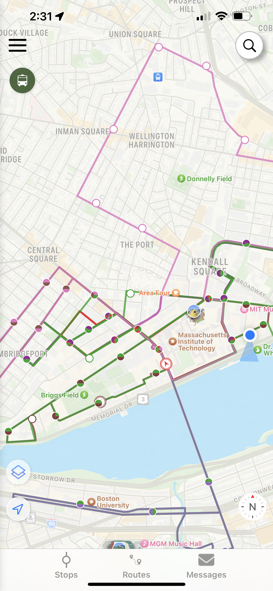
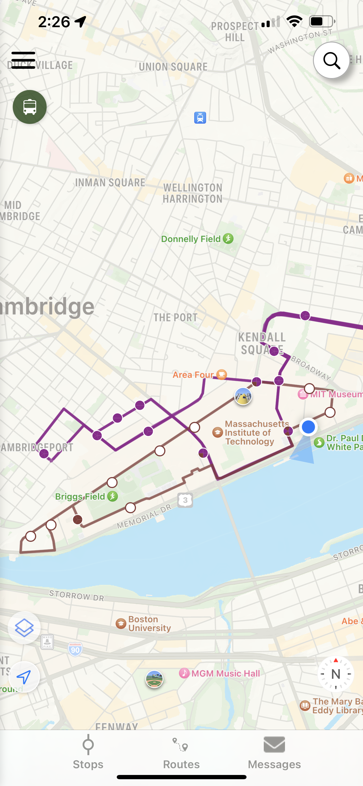

# Blog 2: Lecture 12

Analyzing Passio GO!'s Visual Design

In this blog post I will analyze the visual design of the Passio GO! app, which I use to track the locations of MIT shuttles and EZRide buses.

Initially we are presented with a very familiar map layout, with circles indicating bus stops and different colors used to represent different routes. The purple corresponds to the EZRide evening shuttle, and the brown corresponds to the MIT Tech shuttle, with the colors distinct enough such that users can easily tell the difference. The size of the various buttons in the corners, such as the search icon in the top right and the compass in the bottom right, are small enough that they do not detract from the user’s ability to view the map, and overall the design is uncluttered and pleasant. However, this changes when we add more routes to the map.

If we add more routes to the map, it becomes confusing and chaotic. The brown route is obstructed by the green route, and the only way to see the brown route is to get rid of the green route. In addition, circles indicaating stops shared by multiple routes are split into multiple colors, but these colors are not divided evenly. For example, the stop on Massachusetts Avenue in front of Lobby 7 is 2/10ths red, 3/10ths pink, 1/10th brown, and 4/10ths green. In addition, the red portions of the circle are separated from one another, with one at the top and one at the bottom. I have no idea what this is supposed to indicate. How frequent each route stops there? The order in which routes will stop at this location? It is also unclear what the empty white circles mean - I assumed it meant that there were no vehicles on that route, but the brown circle to the left of Briggs Field is empty even though there is an active Tech Shuttle on Amherst Alley.

Although Passio GO! is usable with a few routes selected, it quickly becomes difficult to use when following many routes. Because of this, if I want to look at multiple routes, I simply deselect all routes and look at each route one by one instead of looking at them all together. I hope that Passio GO! can add updates that make it easier to navigate multiple routes.
